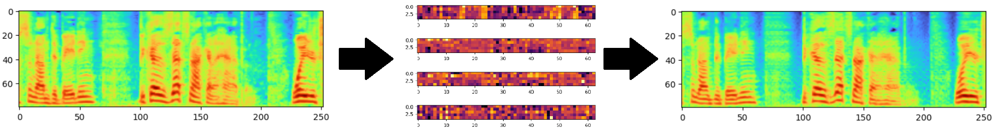

# mel-vae
### Mel spectrogram compression using variational autoencoder

Experiment on 16x spectrogram compression. This architecture uses non-uniform downsampling, where the frequency dimension is reduced more aggressively than the temporal dimension, which, based on my experiments, results in better reconstruction given the same latent size. The provided weights were trained with mels obtained using the HiFi-GAN 22kHz mel settings. Perceptually, the decoded spectrograms sound quite good.
